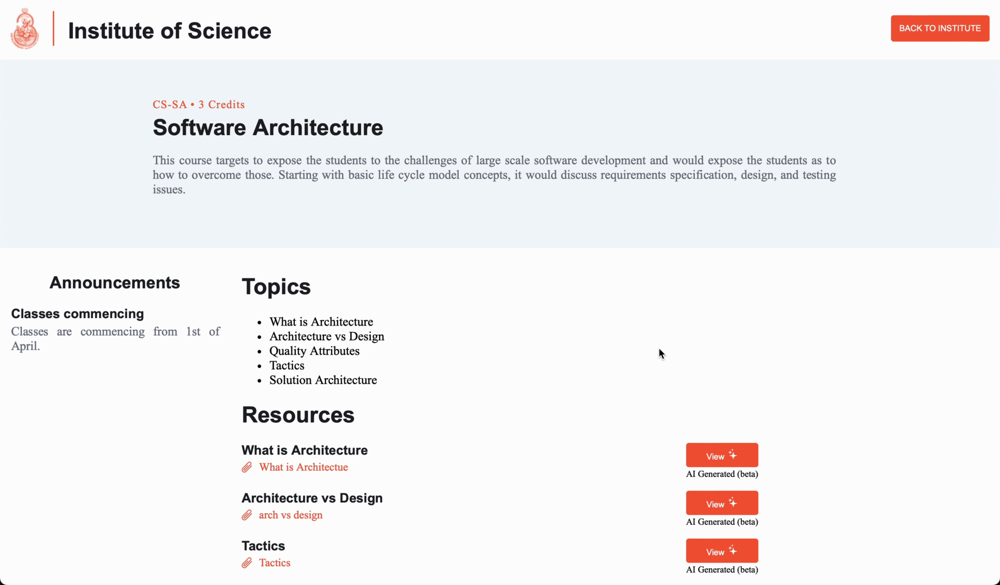

# Reimagining LMS using Large Language Models


## Background

The objective of this project is to transform traditional Learning Management System (LMS) using advanced language models to create a more personalized, and effective learning experience. Automate tasks such as grading, feedback, and content creation to reduce the workload on educators and provide more time for personalized learning.

## System Architecture

THe system design is shown below:


### System Components

The system consists of the following components:

**Content Management System**

Wagtail provides a user-friendly interface that allows content editors to easily manage and update content. The CMS supports the creation of various page types such as Home, Institute, Course, Resource, Announcement, QuestionPaper, Question, and Answer pages, each tailored to specific content needs. Also, Wagtail facilitates the integration of LLM capabilities through Langchain.

**Background Worker**

The background worker is responsible to schedule tasks in the background. It is used to perform tasks such as document summarization, topic extraction, and question generation. The background worker is built using Huey, a distributed task queue that allows the execution of tasks asynchronously.

**LLM API**

The LLM API built using LangChain comprises several key components: document loader, vector store, LLM wrapper, and various agents. Each of these components plays a critical role in the overall functionality of the LMS. LLM API is located at [`llm`](llm) directory.

**External Services**
* DataBase: Uses default Django ORM to store data.
* Embeddings: Supports Langchain Embeddings classes, modify `llm/documents/vectorstore.py` and `lms/settings/base.py` to modify the embeddings.
* Huey: Background worker to schedule tasks, default to SQLITE database.
* LLM API: Supports Gemini and Ollama LLMs. Modify `llm/__init__.py` and `lms/settings/base.py` to change the LLM API.
* VectorStore: Uses Chroma DB VectorStore to store document vectors, modify `llm/documents/vectorstore.py` and `lms/settings/base.py` to modify the vectorstore settings.

## Features

This projects achieves the following features through the use of large language models:

* **Message Classification**: Classify messages into different categories to organize content in a course.
* **Document Summarization**: Summarize long documents to provide a quick overview.
* **Topics Extraction**: Extract topics from the course content to provide a quick overview.
* **Question Generation**: Generate questions from the course content to self-evaluate students.

These features are utilizes the following LLM Agents:

* `ClassificationAngent`: Classifies messages into a enum of options.
* `TopicModelling`: Extracts topics from a list of documents.
* `MapTopics`: Generates a mapping of document and topics using similarity scores.
* `QAAgent`: Generates questions from the topics map (a mapping between document and topics).

### Demo

**Resource Processing**: Summarization and Topic Extraction


**Question Paper Generation**



## Setup

To run this project locally, you will need python 3.8+.

1. Install the dependencies:

   ```bash
   pip install -r requirements.txt
   ```

2. Configure the LLM API:
   You'll need to configure at least `LLM` in `lms/settings/base.py`. Other settings can be modified as needed in `dev` and `production`` settings.

3. Run the migrations:

   ```bash
   python manage.py migrate
   ```

4. Run the server:

   ```bash
   python manage.py runserver
   ```

## License

This project is licensed under the MIT License. See the [LICENSE.md](LICENSE.md) file for details.

